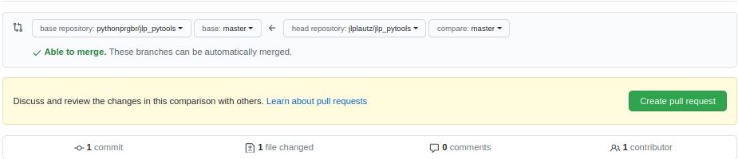
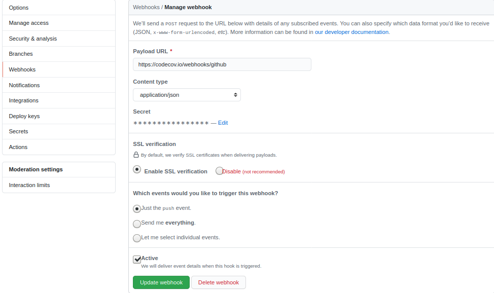

# jlp_pytools
This project is based on Python Pro module pytools

A ideia neste projeto é fazer um projeto iniciando do zero com fork de um instituição 
no github para uma conta pessoal depois o clone para IDLE Pycharm


[](https://pyup.io/repos/github/pythonprgbr/jlp_pytools/)
[](https://pyup.io/repos/github/pythonprgbr/jlp_pytools/)
[](https://codecov.io/gh/pythonprgbr/jlp_pytools)

### 1- Commit action after README file modification
   - in the personal github account a second commit is going to be created
     - Commit for file README modification
     - Initial commit

### 2- Pull requests can be created in the github personal account
   - just to send this modification to original file jlplautz/jlp_pytools -> pythonprgbr/jlp_pytools



### 3- We can verify the branch that we have created
```
Comandos úteis:
    git branch : lista todas branches locais
    git branch --all : listas todas branches, incluindo remotas
    git remote -v: lista todos repositórios remotos conectados
    git remote add <apelido> <link do repositório> : conecta um repositório remoto
    git remote rm <apelido> : desconecta um repositório remoto
    git fetch --all: atualizada todas branchs remotas de todos repositórios remotos
    git fetch <repositorio>: atualizada todas branchs remotas de determinado respositório remoto
    git branch <nome-da-branch>: cria uma branch local
    git checkout <nome-da-branch>: carrega os arquivos de uma branch especifica
```

### 4- We can send the local branch to remote via CMD
   - git push origin master  -> send the local master branch to remote origin

### 5- We need to create upstream remote
   - git remote add upstream git@github.com:pythonprgbr/jlp_pytools.git
```
jlp_pytools $ git remote -v
origin  git@github.com:jlplautz/jlp_pytools.git (fetch)
origin  git@github.com:jlplautz/jlp_pytools.git (push)
upstream        git@github.com:pythonprgbr/jlp_pytools.git (fetch)
upstream        git@github.com:pythonprgbr/jlp_pytools.git (push)
```

### 6-  we can have this modification available in our local branch in Pycharm IDLE
   - project jlp_pytools --> GIT --> Fetch --> the information comes from remotes branch to update the local one.
   - now we can see that upstream branch appeared in the Pycharm IDLE

### 7- We can execute a commit with force push when we did no follow the correct branch steps
   - project jlp_pytools --> GIT --> Commit Directory --> Commit and Push --> Force Push
   - jlp_pytools $ git push origin master -f  --> (-f force)

### 8- Create a virtual environment
   - jlp_pytools $ pyenv local 3.8.1
   - jlp_pytools $ pipenv shell
   - (jlp_pytools) jlp_pytools $ pipenv install flake8 --dev
   - (jlp_pytools) jlp_pytools $ pip freeze > requirements.txt
   - create file ->.flake8
```
[flake8]
max-line-length = 120
exclude = .venv
```
  - create file -> .pyup.yml
```
requirements:
  - Pipfile
  - Pipfile.lock
```
### 9- After we execute a commit and push from local branch to origin remote
   - github in the origin branch we execute a Pull request to send this modificatipn to upstream

### 10- IDLE Pycharm
   - master checkout
   - via gui interface or cli --> git fetch upstream
   - delete the last branch that was committed

### 11- Create a file .gitignore_global in the home user directory
   - these files is not going to be available for any commit to remotes branches
``` 
~ $ more .gitignore_global 
Pycharm files
.idea/
.classpath
.project
.settings/
bin/
*.sqlite3 
```
### 12- to set the file .gitignore_global correctly
   - ~ $ git config --global core.excludesfiles .gitignore_global
```
~ $ git config -l
user.name=61246880
user.email=jorge.plautz@gmail.com
core.excludesfile=/home/plautz/.gitignore_global
core.autocrlf=input
cola.spellcheck=false
```

### 13- procedure to create a virtual environment Ubuntu
   - libs installation:
```
sudo apt-get install -y build-essential libssl-dev zlib1g-dev libbz2-dev libreadline-dev libsqlite3-dev wget curl llvm gettext libncurses5-dev tk-dev tcl-dev blt-dev libgdbm-dev git python-dev python3-dev aria2 vim libnss3-tools python3-venv liblzma-dev
```
   - pyenv installation:
```
curl -L https://github.com/pyenv/pyenv-installer/raw/master/bin/pyenv-installer | bash
```
   - .bashrc file :
```
export PIPENV_VENV_IN_PROJECT=1
export PIPENV_NO_INHERIT=1
export PYENV_ROOT=~/.pyenv 
PATH="${PYENV_ROOT}/shims:${PYENV_ROOT}/bin/:${PATH}"
eval "$(pyenv init -)"
alias mng='python $VIRTUAL_ENV/../manage.py'
```
   - python version installation:
```
pyenv install <versao>
```
   - python global setting:
```
pyenv global <versao>
```
   - To verify the python version available -> pyenv install -l
   - to install python version --> pyenv install 3.8.1
   - to verify python version available --> pyenv versions
```
(jlp_pytools) jlp_pytools $ pyenv versions
  system
  3.8.0
* 3.8.1 (set by PYENV_VERSION environment variable)
```

   - to setting python version global --> pyenv global 3.8.0
   - to setting python version local --> pyenv local 3.8.1
   - to verify python version  --> python2 -V  -> Python 2.7.17
   - to verify python version  --> python3 -V  -> Python 3.8.1

### 14- How can we create a virtual environment Ubuntu
   - create a project directory and inside --> python3 -m venv .venv  
   - meaning (-m -> module called venv)  (.venv -> directory where is the virtual environment)
   - to activate the virtual environment -> source .venv/bin/activate
   - to verify from where the python running -> which python
   - to deactivate the virtual environment -> deactivate
   - to install virtualenv for python2 -> python2 -m pip install virtualenv
   - to install virtualenv for python2 -> python2 -m virtualenv .venv2

### 15- How can we create a virtual environment Pycharm
   - file / settings / Python interpreter / add / verify the project directory
   - directory venv is always created inside of the project directory

### 16- Create automatic dependency upgrade via pyup
   - It is necessary to create a file .pyup.yml -> See item 8
   - https://pyup.io/ -> create account 
   - https://pyup.io/account/repos/add/ --> add your project 

### 17- Install lib pytest parameter --dev
   - (jlp_pytools) jlp_pytools $ pipenv install pytest --dev
   - File | Settings | Tools | Python Integrated Tools --> Default test runner = pytest

### 18- Install lib pytest-cov --dev
   - (jlp_pytools) jlp_pytools $ pipenv install pytest-cov --dev
   - https://codecov.io/gh  -> add directory -> jlp_pytools
   - copy Upload Token from codecov.io
   - Insert token in the file python_app.yml (workflows github action)
   - github create a Webhooks 
   - git actions install lib codecov --> python -m pip install --upgrade pip codecov



### 19- TDD Test Driven Development
   - Create a python package -> spam  and test_spam
   
### 20- Create a test to verify the email account is correct
```
def test_invalid_sender(receiver):
    sending = Sending()
    # here we have a context manager and the code inside of this context
    # is going to generate a exception
    with pytest.raises(InvalidEmail):
        sending.send(
            receiver,
            'contato@luchtransportes.com',
            'Curso Python',
            'Turma de primeira',
        )
        
class Sending(object):
    def send(self, receiver, sender, subject, body):
        if '@' not in receiver:
            raise InvalidEmail(f'Email from sender account is not valid: {receiver}')
        return receiver

class InvalidEmail(Exception):
    pass
```